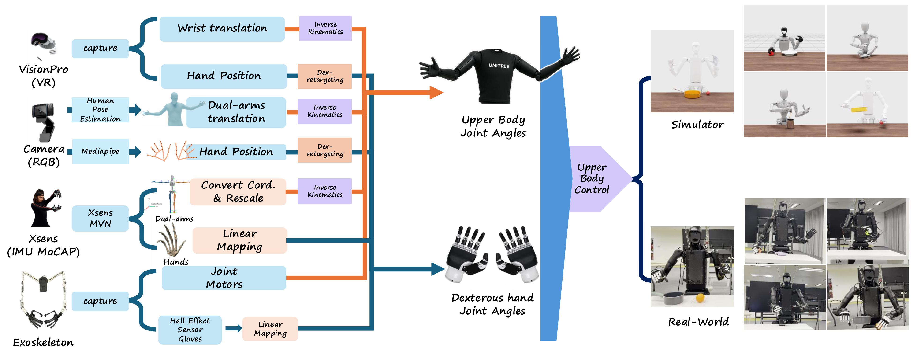

# TeleOpBench: A Simulator-Centric Benchmark for Dual-Arm Dexterous Teleoperation

Hangyu Li$^{\color{red}{\ast}}$, Qin Zhao$^{\color{red}{\ast}}$, Haoran Xu, Xinyu Jiang, Qingwei Ben, Feiyu Jia, Haoyu Zhao, Liang Xu, Jia Zeng, Hanqing Wang, Bo Dai, Junting Dong$^{\color{red}{\star}}$, Jiangmiao Pang

$^{\color{red}{\ast}}$: Equal contribution.  
$^{\color{red}{\star}}$: Corresponding author.

### [Project Page](https://gorgeous2002.github.io/TeleOpBench/) | [Arxiv Paper](https://arxiv.org/abs/2505.12748) | [Video](https://youtu.be/PbimvvNCIdc)

 
---

## TODO list

- [ ] **Release TeleOperation Code** 
- [ ] **Release Simulation Code** 
- [ ] **Release Real-World Deployment Code** 

---

### Acknowledgements

This project is built upon the work of several excellent research projects and open-source contributions. A big thank you to all the authors for sharing their work!

- [avp_teleoperate](https://github.com/unitreerobotics/avp_teleoperate) 
- [pink](https://github.com/stephane-caron/pink.git) 
- [TeleVision](https://github.com/OpenTeleVision/TeleVision) 
- [GRUtopia](https://github.com/OpenRobotLab/GRUtopia) 

---

### Citation

If you find this project useful in your research, please consider citing our paper:

<!-- ```bibtex
@inproceedings{li2025teleopbench,
  title={TeleOpBench: A Simulator-Centric Benchmark for Dual-Arm Dexterous Teleoperation},
  author={Hangyu Li, Qin Zhao, Haoran Xu, Xinyu Jiang, Qingwei Ben, Feiyu Jia, Haoyu Zhao, Liang Xu, Jia Zeng, Hanqing Wang, Bo Dai, Junting Dong, Jiangmiao Pang},
  year={2025},
  booktitle={Conference on Robotics and Automation (ICRA)},
  url={https://arxiv.org/abs/2505.12748}
} -->
